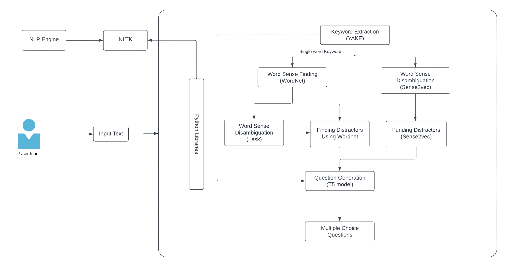

# Enhancing Educational Interactivity: Harnessing Multimodal AI for Dynamic Question Formulation

This repository contains the Google Colab implementation of the research project *"Enhancing Educational Interactivity: Harnessing Multimodal AI for Dynamic Question Formulation."* The goal of this project is to improve the learning experience by dynamically generating questions from educational content using a combination of advanced AI models.

## Overview

This project integrates multiple pretrained models to achieve dynamic question formulation:

- **YAKE**: For keyword extraction from educational texts.
- **WordNet & Lesk**: For word sense exploration and disambiguation to ensure the contextual accuracy of keywords, Wordnet also used for single word keyword distractor generation.
- **T5**: A transformer model used for generating questions based on extracted keywords and their contextual meanings.
- **Sense2Vec**: For generating multi-word keyword distractors, enhancing the complexity and engagement of generated questions.

## Proposed System Diagram

The following diagram illustrates the proposed system architecture for dynamic question formulation:




## Getting Started

### Prerequisites

To run the project, you'll need:

- A Google account to access and run the Colab notebook.
- Basic understanding of Python and Jupyter notebooks.
- Familiarity with NLP concepts such as keyword extraction, word sense disambiguation, and question generation.

### Running the Project

1. **Clone the Repository**: 
   ```bash
   git clone https://github.com/Shiva_C_qwerty/Educational-Interactivity-AI.git
   ```

2. **Access the Colab Notebook**:
   - Open the [Google Colab notebook](https://colab.research.google.com/github/Shiva-C-qwerty/Educational-Interactivity-AI/blob/main/QuestGen.ipynb) in your browser.

3. **Follow the Sections in the Notebook**:
   - The notebook is divided into sections for each of the models and tasks:
     - **Keyword Extraction using YAKE**: Automatically extracts significant keywords from educational texts.
     - **Word Sense Disambiguation using WordNet and Lesk**: Disambiguates the senses of extracted keywords to ensure contextual relevance.
     - **Distractor Generation using Sense2Vec**: Generates multi-word distractors to accompany correct answers, adding challenge to the questions.
     - **Question Generation using T5**: Creates questions from the disambiguated keywords and context.

4. **Run the Cells**:
   - Each section contains code cells with detailed comments. Run them sequentially to execute the full pipeline.

### Example Output

The notebook generates output such as:

- A set of keywords extracted from the input text.
- Disambiguated word senses for each keyword.
- Generated distractor options for multiple-choice questions.
- Dynamically formulated questions based on the textual content.

## Acknowledgments

This project leverages several open-source models and libraries, including YAKE, WordNet, Lesk, Sense2Vec, and T5. Special thanks to the developers and the community for maintaining these resources.
